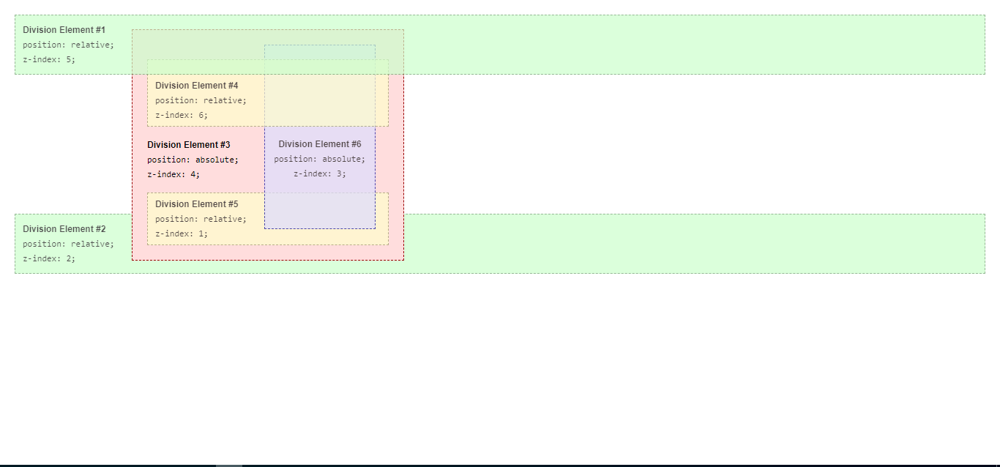

# Understanding how to implement z-index in complex situations
Understanding Z-index

## Built With

- HTML
- CSS

## Live Demo

[Live Demo Link](https://rawcdn.githack.com/happiguru/z-index/c147eadb55fa4935cd9c63ef878557e6a7b529c9/index.html)

## Getting Started

**Navigation bar**
- Go to [Learningo.com](https://learningo.club/do-you-understand-your-code/) and read to understand the implementation of z-index, the purpose of this project is to explain or give a very simplified example of how z-index can be implemented in complex cases.

To get a local copy  and to set it up and running follow these simple example steps.

### Prerequisites

- Browser
- Internet

- Download the code from repository (https://github.com/happiguru/z-index) and double click the index.html file

## Authors

👤 **Stanley Enow Lekunze**

- Github: [@happiguru](https://github.com/happiguru)
- Twitter: [@Lekunze_Nley](https://twitter.com/Lekunze_Nley)
- Linkedin: [lekunze-nley](https://www.linkedin.com/in/lekunze-nley/)

## Show your support

Give a ⭐️ if you like this project!

## Acknowledgments
-This project gave us a better understanding of the visual properties that must be used on a website.

## 📝 License

This project is [MIT](LICENSE) licensed.
